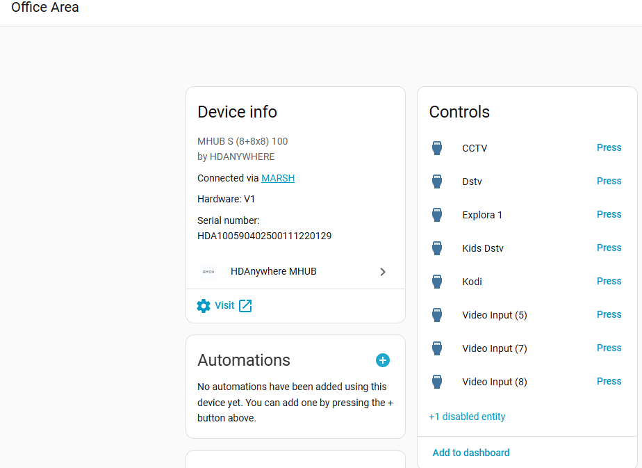
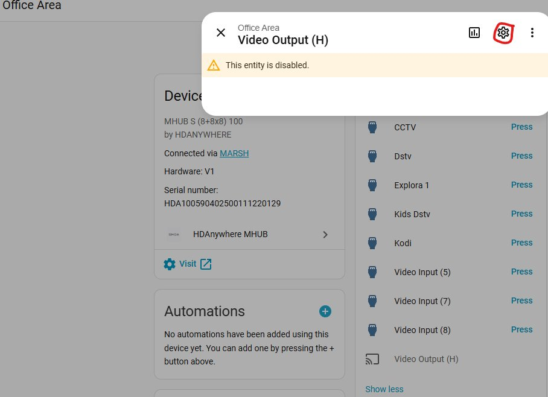
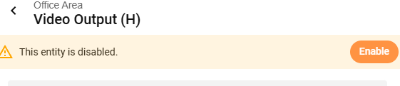
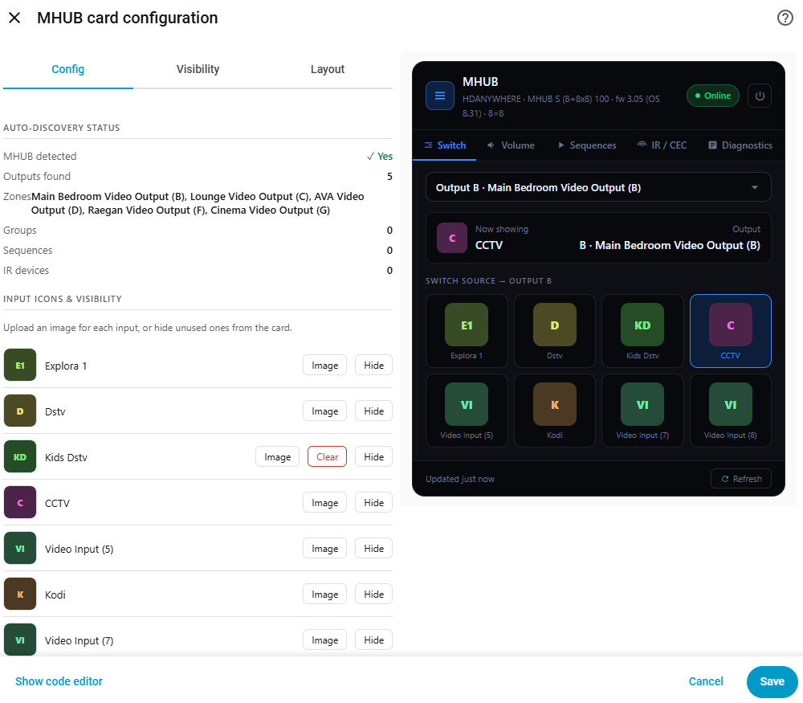
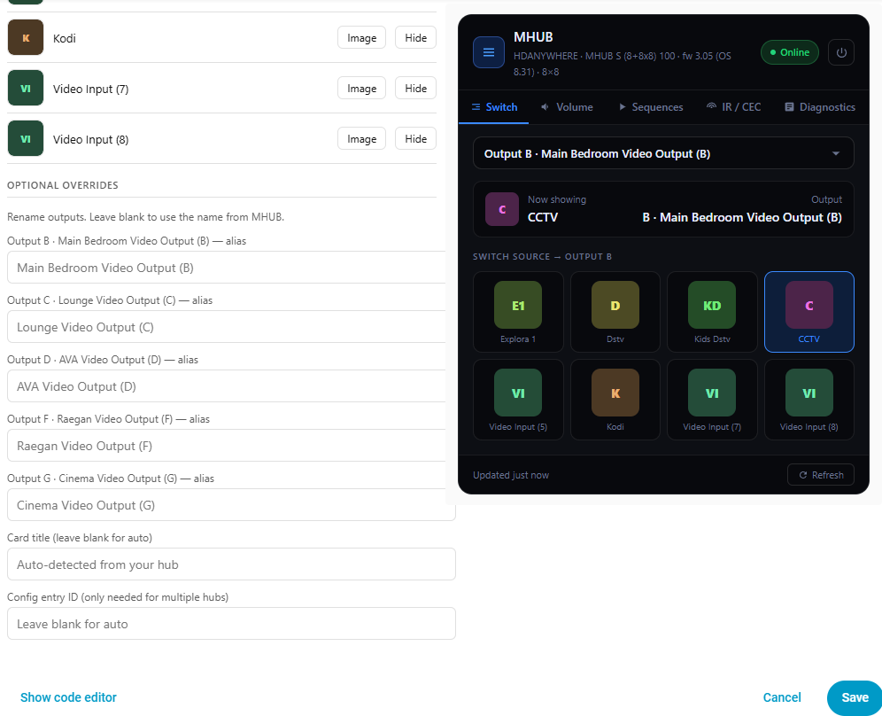
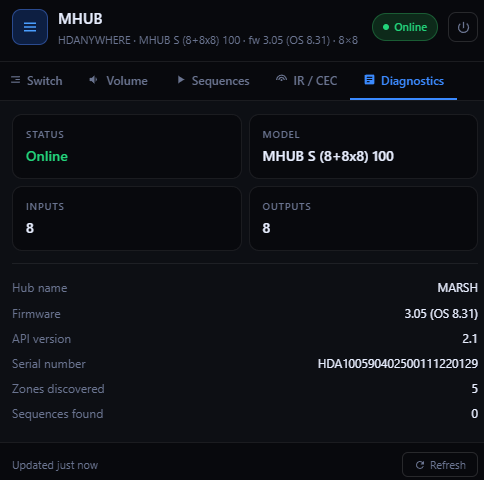
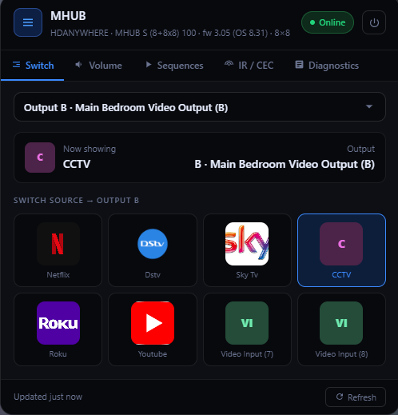

# 📺 MHUB Card for Home Assistant
---

> ⚠️ **This card only works with the HDANYWHERE MHUB custom integration for Home Assistant.**
> It will not work with any other integration. No MHUB integration = no card.

---

[](https://my.home-assistant.io/redirect/hacs_repository/?owner=marsh4200&repository=mhub-card&category=plugin)

> **A fully self-configuring Lovelace card for the [HDANYWHERE MHUB](https://www.hdanywhere.com/) matrix switcher integration.**
> Zero YAML. Zero manual entity entry. Just install and go.


---

## ✨ Features

| Feature | Detail |
|---|---|
| 🔌 **Zero config** | Reads your HA entity registry automatically — no YAML setup needed |
| 🎛️ **Source switching** | Switch any input to any output zone with one tap |
| 🖼️ **Custom input icons** | Upload your own image per input (Netflix logo, Sky, PS5, etc.) |
| 👁️ **Hide unused inputs** | Blank inputs can be hidden from the card entirely |
| 🔊 **Volume control** | Per-zone and group volume sliders with mute toggle |
| ▶️ **Sequences & Functions** | Run MHUB sequences and functions directly from the card |
| 📡(UNDER CONSTRUCTION) **IR / CEC control** | Fire IR and CEC commands from your configured IR packs | (UNDER CONSTRUCTION)
| 🏷️ **Output aliases** | Rename outputs (e.g. "Output B" → "Main Bedroom") |
| 📋 **Diagnostics** | Live hub model, firmware, API version, input/output count |
| ⚡ **Optimistic UI** | Source switches update instantly without waiting for HA poll |
| 🔄 **Auto brand badges** | Netflix, YouTube, Sky Q, PS5, Xbox, Apple TV and more — auto-coloured |

---

## 📦 Installation

### Step 1 — Copy the card file

Copy `mhub-card.js` into your Home Assistant `/config/www/` folder.

```
/config/www/mhub-card.js
```

### Step 2 — Register the resource

In Home Assistant go to:

**Settings → Dashboards → ⋮ (top right) → Resources → + Add Resource**

| Field | Value |
|---|---|
| URL | `/local/mhub-card.js` |
| Resource type | `JavaScript module` |

### Step 3 — Add the card

In any dashboard, click **+ Add Card → Custom → MHUB Card**.

That's it. The card discovers everything automatically.

---

## ⚠️ Critical: Enable the Media Player entities

The MHUB integration creates a `media_player` entity for each video output on your hub. **These are disabled by default** in Home Assistant and must be manually enabled before the card can display your zones.

Without enabling them, the Switch tab will show "No MHUB output zones found" even if your hub is connected.

### How to enable them

**1.** Go to **Settings → Devices & Services → MHUB** and open your hub device.

You will see your outputs listed in the Controls panel. There will also be a note saying **"+1 disabled entity"** (or however many outputs you have):



---

**2.** Click the **"+1 disabled entity"** link or scroll down to find the disabled output entities. Click on one — you will see the "This entity is disabled" banner:



---

**3.** Click **Enable**, confirm, and wait a few seconds for HA to reload the entity. Repeat for each output.



---

Once all output media players are enabled, open or refresh your MHUB Card and your zones will appear automatically.

---

## 🎛️ Card Features In Detail

### Switch Tab ✅
The main tab. Select your output zone from the dropdown at the top, then tap any input source to switch to it. The "Now showing" bar updates instantly.

- Source buttons show auto-coloured brand badges (Netflix, Sky Q, PS5, Xbox, Apple TV, Spotify, Chromecast, Nvidia Shield, Blu-ray, and more)
- Upload your own image per input to replace the auto badge
- Mute button appears if your hub supports it

### Volume Tab ✅
Sliders for every zone and group volume. Mute buttons per zone. Sliders update live without flickering — if you're actively dragging a slider, incoming HA state updates won't interrupt you.

### Sequences Tab ✅
All MHUB sequences and functions discovered from your hub appear here as buttons. Tap to run. A green flash confirms the command fired.


### IR / CEC Tab - UNDER CONSTRUCTION
All IR packs and CEC commands configured in your MHUB integration appear here, grouped by device. Tap any button to send the command instantly.

### Diagnostics Tab ✅
Live read of your hub's model, firmware version, API version, input count, output count, zones discovered, and sequences found. Useful for confirming the integration is connected and pulling data correctly.

---

## ✏️ Editing the Card ✅

Click the **pencil icon** on the card to open the editor. No YAML knowledge needed.

### Input icons & visibility
Every input discovered from your hub is listed. For each one you can:
- **Upload an image** — replaces the auto colour badge with your own logo/image (PNG, JPG, etc.)
- **Hide** — removes the input from the Switch tab entirely (useful for unused or unlabelled inputs like "Video Input 8")
- **Show** — unhides a previously hidden input

### Output aliases ✅
Rename any output zone. Leave blank to use the name from MHUB. The alias appears in the zone dropdown and in the "Now showing" bar.

### Optional overrides ✅
- **Card title** — override the header title (default: "MHUB")
- **Config entry ID** — only needed if you have multiple MHUB hubs

---

## ⚙️ Optional YAML config ✅

The card works with zero YAML, but these overrides are available if needed:

```yaml
type: custom:mhub-card
title: My MHUB                    # Override the header title
entry_id: abc123                  # Force a specific config entry (multi-hub setups)
zone_aliases:
  A: Living Room                  # Rename Output A
  B: Main Bedroom                 # Rename Output B
hidden_inputs:
  - Video Input 8                 # Hide this input from the Switch tab
input_icons:
  Netflix: mhub_icon_abc123       # Managed automatically by the editor
```

---

## 🏷️ Auto Brand Colours

These source names are automatically detected and given brand-accurate colours and badges. Any source not in this list gets a unique colour generated from its name with initials as the badge.

| Source name contains | Badge | Colour |
|---|---|---|
| netflix | N | Red |
| youtube | YT | Red |
| sky q / sky | SKY | Blue |
| ps5 | PS5 | Dark blue |
| ps4 | PS4 | Dark blue |
| xbox | X | Green |
| apple tv / appletv | ATV | Dark |
| spotify | SP | Green |
| fire tv / firetv | F | Orange |
| chromecast | CC | Blue |
| nvidia shield / shield | NV | Green |
| blu-ray / bluray | BR | Blue |
| hdmi / laptop / pc | H/LP/PC | Blue-grey |

---

## 🔧 Troubleshooting

**Card shows "No MHUB output zones found"**
→ Your media player entities are disabled. Follow the [Enable Media Players](#️-critical-enable-the-media-player-entities) steps above.

**Sequences tab shows wrong/too many sequences**
→ The card uses the HA device registry to isolate MHUB sequences. If you see non-MHUB sequences, try hitting the Refresh button on the card footer.

**IR tab is empty**
→ Make sure you have IR packs configured in your MHUB integration options. The card reads them from the device registry — they must be set up in the integration first.

**Custom icons don't appear on another device/browser**
→ Icons uploaded via the editor are stored in your browser's localStorage. You'll need to re-upload them on each device/browser you use.

**Model / Firmware shows "—" in Diagnostics**
→ The hub status sensor may not have loaded yet. Hit Refresh or wait a few seconds for the integration to poll the hub.

---

## 📋 Requirements

| Requirement | Detail |
|---|---|
| Home Assistant | 2023.9 or newer recommended |
| MHUB Integration | HDANYWHERE custom integration installed and configured |
| MHUB firmware | Any version supported by the integration |
| Media player entities | Must be **manually enabled** after integration setup |

---
---

## 🖼️ Card Screenshots


### Source Switching / Controls / Custom Icons


### Features


### Diagnostics



### Overview


---

## 📄 Version

**mhub-card ** — Self-configuring Lovelace card for the HDANYWHERE MHUB integration.
